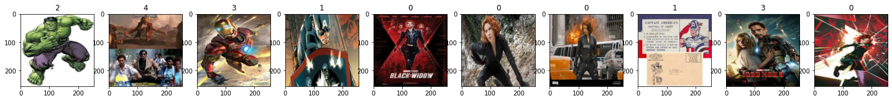
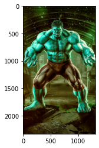
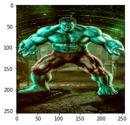
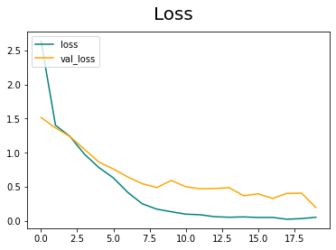
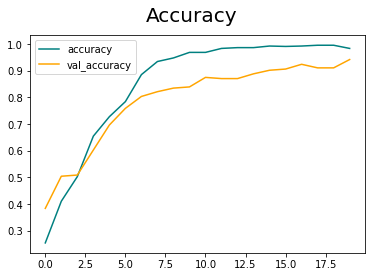

Problem Statement :

-Basic Image classifier CNN
- So Neural Nets are your go to approach for solving any problem.
- Create a labeled dataset of Avengers images- Captain America, Iron
Man,Black Widow, Hulk,Thor. (Try scraping images from internet , instead of
manually creating the dataset)
- Train a CNN that is able to classify an unseen image with reasonable accuracy.
- You can use frameworks like PyTorch and Keras to simplify your workflow.
Bonus: Use only one image for each class, and build a model that can predict the
classes. This uses a special technique that you can look up on google

- My Approach :
  
  1. Creating a Decent Dataset from scratch 

     - By using a chrome extension tool download all images in a webpage

  2. Cleaning the Dataset

     - Delete images of size <= 9 kb because their resolution is low hence they will not contribute to the model that much 
     - Delete unwanted svg files 


  3. Create a .py or .ipynb file for the CNN Model
     
     - a) import libraries 
     - b)By using opencv and imghdr remove files other than jpg,png,bmb and jpeg format
     - c) Load data using image_dataset_from_directory method which will automatically identify the classes in the dataset 
     
     - d) Data preprocessing 
         - i) Scaling the data 
                                        
         - ii) Spliting the data
               - Train (65.625 % - Batches) ,          Test(12.5 % - 4 Batches) and 
               valdation(21.875 % - 7 Batches)data
    - e) Model
         - i) Creating a CNN Architecture 
         - ii) Training the model
         - iii) Performance of model on Training and validation Data over 20 Iterations/epochs
         - iv) Performance of model on Test data
         - v) Performance of Model on unknown Test cases
         - vi) Save the model
         <h2> Bonus
         - vii) we can Train the model using 1 image per class using a method known as Transfer learning which uses a Pretrained model and Trains it in the new dataset 


- Algorithm :
    
    - The core part of the model lies in Understanding the CNN Architecture used .
    - The Code for our Model is 
    ``` model=Sequential()

        model.add(Conv2D(16,(3,3),1,activation='relu',input_shape=(256,256,3)))
        model.add(MaxPooling2D())

        model.add(Conv2D(32,(3,3),1,activation='relu'))
        model.add(MaxPooling2D())

        model.add(Conv2D(64 ,(3,3),1,activation='relu'))
        model.add(MaxPooling2D())

        model.add(Flatten())
        model.add(Dropout(0.2))

        model.add(Dense(512,activation='relu'))
        model.add(Dropout(0.2))

        model.add(Dense(5,activation='softmax'))

        model.compile('adam',loss=tf.losses.sparse_categorical_crossentropy,metrics=['accuracy'])
        model.summary()
    ```
    <h3>Sequential()
    - Takes the Methods provided in Sequencial order

    <h3>Convolution
    - Convolution operation is done on the Image matrix  
    - Conv2D is a 2 D COnvolutional layer when used for first time Input shape of image must be Given (256,256,3)
    -  16 is the Filter size  , (3,3) is the Kernel    size specifying the height and width of the 2D convolution window

    <h3>Activation Function
    - 'relu' activation or Rectified Linear Unit is an activation function gives 0 for negative input and 
                              x for positive input 
        relu=max(0,x) for input x 

    - 'relu' is used for Convolution layers

    -  'softmax' is an another Activation Function which Assigns Decimal probabilities to each class in a multi class problem .
    - Softmax is used on the Final layer (Dense Layer) 

    <h3>Max pooling
    - It is a Type a pooling operation where max value of the pixel is taken in account around a window of pixel
    - Default window size is  (2,2)
     
    <h3>Flatten
    - Converts Multi dimensional tensor to Single Dimensional tensor
    - Reshape layer

    <h3>Dropout
    -  Dropout is a technique where randomly selected neurons are ignored during training. They are “dropped out” randomly. This means that their contribution to the activation of downstream neurons is temporally removed on the forward pass, and any weight updates are not applied to the neuron on the backward pass.
    - The neurons can't rely on one input because it might be dropped out at random. This reduces bias due to over-relying on one input, bias is a major cause of overfitting.

    <h3>Dense
    - Common neural network layer with the task to classify the Output from the previous layers into their respective classes.


 Images
            
      
      


- Tools Used
    
    - Chrome extension : https://download-all-images.mobilefirst.me (download all images)
    - jupyter Notebook
    - Language : python
    - Libraries : cv2 ,imghdr , matplotlib , numpy , tensorflow , keras
    
- Conclusion
       - so this model predicts the Avengers with  F1 score around 0.98 .This model can be still improved by  training with more data , and with still good CNN architecture .

